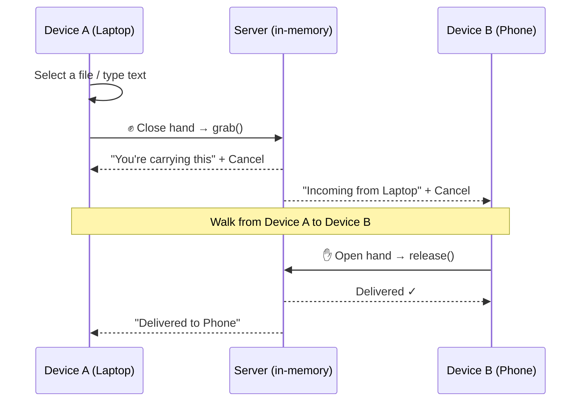

<div align="center">

# ✋ Gestures

### Touchless, multi-device file transfer — grab with a fist, release with an open palm

*Select a file on one device, close your hand, walk to another device, open your hand — it's there.*

[](https://www.python.org/)
[](https://fastapi.tiangolo.com/)
[](https://developers.google.com/mediapipe)
[](tests/)
[](LICENSE)
[](#requirements)

</div>

---

## What is this?

**Gestures** turns hand movement into a file-transfer gesture, inspired by Huawei's Air Gesture "grab and drop" feature — but cross-platform, local-only, and open. No cables, no AirDrop-style pairing dance, no cloud upload. Just:

```
  ✊ Close your hand           🚶 Walk over           ✋ Open your hand
  ───────────────────    ──────────────────    ──────────────────
   grabs the selected      to any other of        delivers it —
   file on this device      your devices           transfer done
```

Every device on your WiFi that's running the app becomes a pickup/drop-off point. Multiple people can use it **at the same time**, each with their own transfers, with zero cross-talk.

---

## ✨ Highlights

| | |
|---|---|
| 🖐️ **Gesture-native** | Close (fist) = grab · Open (palm) = release. No buttons for the actual transfer. |
| 📦 **Multi-file bundles** | Select text *and* several images/files at once — one grab moves all of them together, atomically. |
| 👥 **True multi-user** | Person A and Person B transfer independently and simultaneously; no shared state leaks between them. |
| 🧠 **Smart gesture filter** | A 3-test confidence engine (pose clarity, motion, stability) throws out fidgeting and hand-relaxation — only intentional gestures fire. |
| 🪪 **Face + hand recognition** | Walk up to any device already running the app and it recognizes you — no code to type. |
| 🔌 **Self-healing connections** | Drops WiFi mid-session? Auto-reconnects with backoff and rejoins as the same person. Link codes survive a 15-minute grace window. |
| 🎥 **Full camera control** | One-click camera on/off that actually stops the hardware and every background loop touching it. |
| ❌ **Cancel anytime** | An in-flight transfer (on either end) can be aborted with one click — no gesture required. |
| 🔒 **Local-first** | Self-signed HTTPS on your LAN. No external tunnel, no cloud relay, nothing leaves your WiFi. |
| 🗄️ **Session-only state** | Everything lives in memory. Restart the server, everything's gone — by design. |

---

## 🚀 Quick Start

```powershell
# 1. Install dependencies
pip install -r backend/requirements.txt

# 2. Run the server (face model auto-downloads to D: drive, not C:)
python run_https.py
```

```
====================================================================
  On this PC:        https://localhost:8443
  On your phone:     https://192.168.31.49:8443
  (accept the self-signed certificate warning on first load)
====================================================================
```

Open that URL on **every device** you want in the transfer group — same WiFi, no VPN, no port forwarding.

---

## 🎬 How a Transfer Actually Works



Opening your hand on the **same device** that grabbed the item is a deliberate no-op — you have to actually move to a different device for the release to count. That's what makes this a *transfer*, not a toggle.

---

## 🖥️ The Interface

```
┌─────────────────────────────────────────────────────────────────────┐
│  ✋ Gestures                                    2 people online (3)  │
├───────────────────┬───────────────────────────────────────────────┬─┤
│                    │  Close your hand (fist) to grab this          │
│    [ live camera ] │  ┌───────────────────────────────────────┐   │
│    [ hand overlay ]│  │ Type text to hold...                    │   │
│                    │  └───────────────────────────────────────┘   │
│  [ Turn camera off]│  🖼 photo1.jpg ×   🖼 photo2.jpg ×  📄 doc ×  │
│                    │                                                │
│  hand: Open (92%)  ├────────────────────────────────────────────────┤
│  face: recognized  │  ⚠ You're carrying this          [ Cancel ]   │
│                    ├─────────────────────────┬──────────────────────┤
│                    │  Received                │  Your devices        │
│                    │  "here's the file!"       │  • laptop (this)     │
│                    │  [ image preview ]        │  • phone             │
│                    │                            │  • tablet             │
└───────────────────┴─────────────────────────┴──────────────────────┘
```

Every gesture readout is **color-coded live**:

| Color | Confidence | Meaning |
|:---:|:---:|---|
| 🟢 | ≥ 70% | High confidence — the gesture will fire |
| 🟠 | 40–70% | Medium — may or may not register |
| ⚫ | < 40% | Too low — treated as fidgeting, ignored |

---

## 🧩 Architecture

```
┌─ Browser (per device) ───────────────────────────────────────────┐
│  MediaPipe HandLandmarker  →  landmarks only sent over the wire  │
│  Camera JPEG (throttled)   →  face frames, only every 2–6s       │
│  WebSocket client          →  auto-reconnect, exponential backoff│
└────────────────────────────────┬──────────────────────────────────┘
                                  │ wss://
┌─────────────────────────────────▼──────────────────────────────────┐
│  FastAPI + one /ws endpoint (backend/main.py)                      │
│  ├─ Gesture classifier (TensorFlow Lite, CPU)                      │
│  ├─ Gesture discriminator (pose + motion + stability, 3-test)      │
│  ├─ Hand geometry ID (lightweight, no extra model)                 │
│  ├─ Face recognition (InsightFace buffalo_l, CPU by default)       │
│  └─ SessionManager — grab() / release() / cancel_transfer()        │
│     in-memory only, 15-min disconnect grace period                 │
└──────────────────────────────────────────────────────────────────┘
```

No database. No message queue. No microservices. One process, in-memory state, because the actual scale here is "a handful of people in one room" — not a system that needs to survive a restart.

---

## 📁 Project Layout

```
backend/
├── main.py                  FastAPI app + the one /ws WebSocket endpoint
├── session_manager.py       grab / release / cancel state machine
├── gesture_discriminator.py 3-test confidence filter (no fidget triggers)
├── hand_identifier.py       hand-geometry person identification
├── face_engine.py           SCRFD + ArcFace face recognition (CPU)
├── inference.py             gesture classification (TensorFlow Lite)
├── storage_config.py        redirects model downloads off C: drive
└── clarification.py         small rule-based "what do you mean?" layer

frontend/
├── index.html               layout
├── app.js                   camera, gestures, WebSocket, rendering
└── style.css                theme

tests/                       29 tests, session state machine + gestures
Bugs/                        every real bug hit, root cause, and fix
```

---

## 🛠️ Requirements

- Windows 10/11
- A webcam
- Everyone on the same WiFi (no internet required)
- Free space on **any** drive for the ~340MB face model (configurable, defaults to `D:\gesture-hold-data`)

```powershell
# Point model storage somewhere else if D: isn't available:
$env:GESTURE_HOLD_STORAGE = "E:\my-models"
python run_https.py
```

---

## 🧪 Testing

```bash
python -m pytest tests/ -v      # 29 tests: state machine, gestures, grace period
curl -k https://localhost:8443/status   # live multi-user status
```

---

## 📚 Docs

| Doc | What's in it |
|---|---|
| [DEPLOYMENT.md](DEPLOYMENT.md) | Full setup, multi-user walkthrough, troubleshooting |
| [QUICK_START.md](QUICK_START.md) | The 4-step transfer flow, gesture meanings |
| [GESTURE_DEBUG.md](GESTURE_DEBUG.md) | How the confidence system works, how to test your setup |
| [IMPROVEMENTS.md](IMPROVEMENTS.md) | Technical changelog |
| [Bugs/](Bugs/) | Every real bug found, its root cause, and the exact fix |

---

## 🙏 Credits

- Hand tracking base: [kinivi/hand-gesture-recognition-mediapipe](https://github.com/kinivi/hand-gesture-recognition-mediapipe)
- Hand landmarks: [MediaPipe HandLandmarker](https://developers.google.com/mediapipe)
- Face recognition: [InsightFace](https://github.com/deepinsight/insightface) (buffalo_l — SCRFD + ArcFace)
- Server: FastAPI + Uvicorn

## License

MIT — see [LICENSE](LICENSE).
